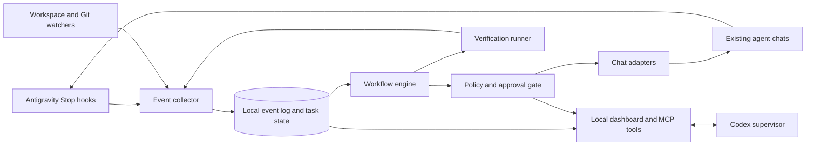

# Veyrezio masterplan

> A local supervisor for coding agents that observes work, routes requests, and proves completion.

**Status:** Local Windows pilot running. The plan below includes completed pilot work and future capabilities. See the [Veyrezio README](../../../veyrezio/README.md) and [Test 1 proof](../TEST-1-PROOF.md) for current behavior.

**First pilot:** The five existing Antigravity agent chats for Intergrid, with Codex as the supervising assistant. Veyrezio should later support other projects and agent tools.

## Pilot status, 2026-10-03

The local app maps all five existing chats and worktrees. It delivered one reviewed task to each agent in parallel, collected all five results, and showed the batch in its dashboard and MCP brief. Codex used the local MCP bridge to read status and coordinate follow-ups. The integrated Intergrid app passed the scoped Asset discover and inspect flow after owner fixes. See the [Test 1 proof](../TEST-1-PROOF.md).

Test 2 added reviewed dependency edges, an answered-contract gate, a final project check, and one bounded owner-local report repair. The [Test 2 proof](../TEST-2-PROOF.md) records a live Asset-to-Discovery handoff and a passing final check. Veyrezio still asks for a human decision when a contract is missing or a check failure has no safe owner mapping.

The phase checklists below remain the broader product plan. They include work that Test 1 did not accept: automatic contract decisions, persistent workflow dependencies, slice-specific checks, transcript capture, and a separate Codex worker. The pilot does not certify those features.

## 1. Problem and outcome

The Intergrid agents work in separate chats and worktrees. Veyrezio now maps their existing chats, sends scoped parallel batches, and reads reports and Stop events. The shared `chat.md` records decisions, but writing a line there does not deliver a live message to another agent.

Veyrezio should run that coordination loop. It should identify what changed, find the responsible agent, send a useful message, wait for evidence, and report the next action. It must stop at real blockers and at actions that need a human decision.

**Target outcome:** One person can supervise the project from one view. The person sees agent status, open questions, contract decisions, checks, and the exact evidence behind a completion claim.

### Success for the first pilot

1. Map A1–A5 to their existing Antigravity conversations and Intergrid worktrees.
2. Show each agent's current task, latest observed event, open requests, and blockers.
3. Deliver a routed request to the right existing chat without duplicate messages.
4. Detect a reply or handoff and update the task state with its source.
5. Stop repeated prompts when an agent waits for a contract, credentials, permission, or another human decision.
6. Run only the checks required for the selected Intergrid slice and record their real results.
7. Produce a final report that names completed work, remaining work, failed checks, and human decisions.
8. Let the operator pause dispatch immediately and inspect the full event history.
9. Let Codex inspect the same state, propose a decision, and route an allowed message through Veyrezio.

Completion means the **selected slice** meets written acceptance criteria. It does not mean the full Intergrid roadmap is built.

## 2. Product rules

- **Local first.** Keep the supervisor, state, and logs on the user's machine by default.
- **Event driven.** React to chat stops, file changes, and check results. Avoid blind `next?` prompts.
- **Existing chats first.** Connect to A1–A5 without replacing their conversations or worktrees.
- **One owner per file.** Respect the Intergrid agent plan and approved public contracts.
- **Evidence before completion.** A chat claim alone cannot close a task.
- **Human control.** Show proposed actions and allow pause, resume, and manual override.
- **Least access.** Read only configured projects and keep credentials outside source and logs.
- **Traceable decisions.** Link every routed message, state change, and check to its source event.

## 3. Main user flow

1. The operator creates a project profile and selects the repository.
2. The operator maps agent names, worktrees, and existing conversation IDs.
3. Veyrezio imports the selected task plan and checks file ownership.
4. Veyrezio observes chat stops, canonical coordination notes, reports, and Git state.
5. The workflow engine classifies a new event as progress, question, handoff, blocker, or completion claim.
6. The engine proposes the next action and names its source and destination.
7. The dispatcher sends an allowed message to the exact chat and stores a delivery receipt.
8. The verifier checks a delivered slice in its integration context.
9. Veyrezio reports completion when all required evidence exists, or reports the unresolved blocker.

The operator can edit a proposed message, resolve a contract, pause an agent, or take over the next action.

## 4. System design



### Collector

The collector accepts structured adapter events and file events. It assigns a project, agent, source, timestamp, and stable event ID. It validates input, stores the original payload safely, and rejects duplicates.

For Antigravity, use [lifecycle Stop hooks](https://www.antigravity.google/docs/hooks) as the primary signal that a conversation became idle. The hook payload can identify the conversation and termination state. A file watcher can read Intergrid's canonical `docs/Agents/chat.md` and each owner report. File changes are evidence sources, not a substitute for a live chat message.

### State store

Use a local SQLite database for an append-only event history and current projections. The database stores task state, agent mapping, dependencies, message receipts, check results, and operator decisions. Keep large transcripts and artifacts as referenced files with retention rules.

### Workflow engine

The workflow engine advances a task only when its dependencies and owner contract allow the action. It creates a proposed next step from a specific event. It must explain why it chose that agent and prompt. A state transition can be reversed by an operator decision, while the event history remains intact.

### Policy gate

The gate checks scope, recipient, repeat count, cooldown, ownership, and action class. It rejects a message when the project is paused, a contract is unresolved, or the same request has already been delivered. It asks for a human decision when the next action needs credentials, access, release authority, or a disputed contract.

### Adapters and dispatcher

An adapter converts a generic action into a supported tool call and returns a receipt. The first adapter uses an Antigravity sidecar and its documented `agentapi send-message <conversation_id> <prompt>` command. [Antigravity sidecars](https://www.antigravity.google/docs/sidecars) require explicit enablement. Their documented `agentapi` commands create or message conversations; they do not document a conversation listing command. The first setup therefore maps existing IDs from hook events or operator input.

Codex has two roles. It can supervise Veyrezio through MCP tools, and it can be a worker with its own task. Keep these roles separate in the project profile and audit log.

For a Veyrezio-owned Codex task, use the supported [Codex app-server](https://learn.chatgpt.com/docs/app-server) interface to start or resume a thread, start a turn, and read its events. Store the thread ID and turn status. Treat an interrupted or failed turn as incomplete. Do not assume an external app-server process can take control of this existing Codex desktop chat.

For this Codex desktop chat, Veyrezio provides tools that I can call while the task is active. Veyrezio cannot silently wake or message this chat through its MCP server. Any future background wakeup must use a supported Codex task or automation surface with the user's authorization. Never use private application databases as the integration path.

### Verification runner

The runner executes an allowlisted command in the configured checkout and stores the exit code, output location, commit or tree identity, and time. It distinguishes owner-local checks from integration checks. The project profile defines required checks. A failing or skipped check remains visible.

### Operator interface

The local dashboard shows a project timeline, agent cards, dependency graph, open decisions, proposed messages, delivered messages, and verification evidence. A local MCP interface should expose the same controlled operations to Codex or other assistants: read status, inspect evidence, propose a message, send an approved message, pause, resume, and record a decision. Bind the service to loopback by default and authenticate write operations.

The Codex MCP tools should include `veyrezio_status`, `veyrezio_events`, `veyrezio_blockers`, `veyrezio_propose_action`, `veyrezio_dispatch_action`, and `veyrezio_pause`. Return structured IDs and evidence links. The policy gate must enforce permissions even when Codex calls a write tool. Codex should report its reasoning and requested decision to the operator in this chat.

### Codex supervision loop

1. Veyrezio records a new Antigravity event and updates the task state.
2. Codex reads the event and linked evidence through Veyrezio's MCP tools.
3. Codex checks the Intergrid plan, owner boundary, contract state, and next dependency.
4. Codex proposes a specific message, check, or human decision.
5. Veyrezio applies its policy gate and returns an action ID or a reason to stop.
6. Codex reviews the result and reports progress or a blocker to the operator.

Veyrezio owns durable state and delivery. Codex supplies judgment within the active task. The operator remains the authority for scope, credentials, permissions, and publication.

### Optional visual adapter

[Antigravity Remote Control](https://www.antigravity.google/docs/remote-control/) can support user-led visual review. Screen access is optional and separate from the core event and sidecar path. Capture only when enabled for a specific session. Do not make continuous screenshots a requirement for supervision.

## 5. Core records

| Record | Required fields | Purpose |
| --- | --- | --- |
| Project | ID, repository root, policy, acceptance criteria | Limits Veyrezio to one configured workspace. |
| Agent | ID, owner scope, worktree, adapter | Identifies who can change what. |
| Session | Tool, conversation ID, agent ID, last event | Routes messages to an existing chat. |
| Task | ID, owner, state, criteria, dependencies | Tracks work toward a defined slice. |
| Contract | Producer, consumer, proposal, decision, version | Prevents private or invented cross-module calls. |
| Event | ID, source, time, payload reference, parent | Records what actually happened. |
| Message | Recipient, reason, content, delivery receipt | Prevents duplicate prompts and supports audit. |
| Check | Command, checkout, revision, result, evidence | Supports a completion claim. |
| Decision | Actor, question, answer, scope, time | Records human and coordinator choices. |

Task states: `planned → ready → running → waiting → handoff → integrating → verifying → complete`. A task can move to `blocked` from any active state. Only a new event or recorded decision can move it out of `blocked`.

## 6. Automation rules

1. Send a message only when a new event or decision changes the next action.
2. Name the request, owner, expected result, and source in each agent message.
3. Use a stable action ID and receipt to make retries safe.
4. Apply a per-chat cooldown and a retry limit. Show repeated failures to the operator.
5. Do not send `next?` or restate the entire plan without a specific need.
6. If two agents disagree on a contract, stop dependent dispatch until the coordinator records a decision.
7. If an agent reports a missing secret, access grant, or unavailable service, mark it blocked. Do not ask it to retry without a state change.
8. After a handoff, check the agreed public contract and integration state before assigning downstream work.
9. Keep the canonical chat as a durable decision log. Deliver time-sensitive requests through the live chat adapter.
10. Close a task only after its acceptance criteria and required checks have evidence.

### Message format

Use short messages with a stable reference:

```text
[Veyrezio action VZ-0042] @Agent2
Agent1 approved AssetSnapshot v1 in docs/Agents/chat.md, Log 4.3.
Use that public contract for the discovery slice. Update your report with the changed files and checks.
Reply with a handoff or a precise blocker. Do not edit Agent1-owned files.
```

Veyrezio stores the action ID, destination conversation, send result, and source event. It must not infer delivery from a file edit alone.

## 7. Security and control

- Store credentials in the user's secret store or ignored local configuration. Never place them in prompts, screenshots, Git, or normal logs.
- Limit file access to configured repository roots. Treat chat text, reports, and hook payloads as untrusted input.
- Require operator approval for commits, pushes, publication, installs, permission changes, destructive commands, and messages outside the configured agent set unless the operator grants a narrower explicit policy.
- Keep read-only observation available even when sending is paused.
- Show which adapter sent each message and the exact text it sent.
- Support project export, retention limits, and deletion of local event data.
- Record command output with redaction and a size limit. Never claim a check passed when it did not run.

## 8. Delivery plan

### Phase 0 — Discover and define

- [ ] Confirm the Antigravity version and supported hook and sidecar behavior on this machine.
- [ ] Map A1–A5, conversation IDs, worktrees, file owners, and current task scope.
- [ ] Write acceptance criteria for one Intergrid integration slice.
- [ ] Select the local runtime, state directory, and operator authentication method.

**Exit:** A project profile and a reviewed map of agents, sessions, tasks, and permissions exist.

### Phase 1 — Read-only observer

- [ ] Ingest Stop hook events and selected workspace changes.
- [ ] Deduplicate events and show a timeline, statuses, open requests, and blockers.
- [ ] Detect stale mappings and missing events.
- [ ] Export a report without sending messages or running commands.
- [ ] Expose read-only status, events, and blockers to Codex through local MCP tools.

**Exit:** The dashboard matches the observed A1–A5 state and cites each source.

### Phase 2 — Assisted message routing

- [ ] Install an explicitly enabled Antigravity sidecar.
- [ ] Preview the exact recipient and message before dispatch.
- [ ] Send to an existing conversation and record the receipt.
- [ ] Add cooldown, retry limits, and a one-click pause.
- [ ] Run in preview mode before the operator enables automatic routing.
- [ ] Let Codex propose an action and receive the policy result through MCP.

**Exit:** Codex proposes one routed request. The request and reply complete without a duplicate or wrong recipient.

### Phase 3 — Dependency and contract workflow

- [ ] Import scoped tasks and dependency edges from the approved plan.
- [ ] Track contract proposals, approvals, and blocked consumers.
- [ ] Route handoffs to the coordinator and then to waiting agents.
- [ ] Stop on disputed or missing contracts.

**Exit:** A dependent agent starts only after an approved contract becomes available.

### Phase 4 — Verification and completion

- [ ] Run allowlisted owner and integration checks in the right checkout.
- [ ] Capture results and compare them with acceptance criteria.
- [ ] Generate a completion report with evidence, gaps, and open decisions.
- [ ] Stop or pause dispatch when the scoped task completes.

**Exit:** The operator can reproduce the result and see every incomplete criterion.

### Phase 5 — Codex worker and more tools

- [ ] Add a Codex worker adapter through app-server for Veyrezio-owned threads.
- [ ] Show Codex thread events, turn status, and results beside Antigravity agent events.
- [ ] Add another tool only after confirming a stable integration surface.
- [ ] Add opt-in visual inspection where screen evidence helps.
- [ ] Support multiple projects without mixing agent IDs, secrets, or event histories.

**Exit:** A Codex worker and an Antigravity worker appear in one project trace. A second project can use the same workflow.

## 9. Intergrid pilot contract

The pilot uses Intergrid's existing [five-agent plan](../Agents/README.md), [canonical chat](../Agents/chat.md), and per-agent reports. Agent5 owns code integration unless the operator records another owner. Codex can supervise the coordination loop through Veyrezio. Veyrezio stores state and routes actions. Neither takes ownership of Agent1–Agent4 module files.

Before repository checks, the pilot must honor Intergrid's live governance connection. If `npm run mcp:connect` fails, Veyrezio records the failure and stops repository work. It never reads a cached governance file as a replacement. The system can still display its existing local event history.

Pilot acceptance requires a complete trace for one dependency: question, contract decision, routed message, agent handoff, integration check, and final report. The trace must preserve the selected worktrees and show any skipped or failed check.

The Codex part of the pilot must show one event read, one proposed action, one policy decision, and one reported outcome. It must clearly distinguish this active desktop chat from any new Codex task created through app-server.

## 10. Decisions to make before implementation

| Decision | Recommended first setting |
| --- | --- |
| Automatic sends | Start with preview, then allow only A1–A5 messages. |
| Coordinator | Keep Agent5 for Intergrid integration. |
| Commits and publication | Require explicit operator action. |
| Screen access | Keep disabled until a visual review needs it. |
| Data retention | Keep a configurable local history with a clear delete control. |
| Completion scope | Use one written Intergrid slice at a time. |
| Codex role | Use this chat as an interactive supervisor. Use app-server only for separately managed worker threads. |

## 11. First release boundary

The first release supervises existing chats, routes scoped messages, and records evidence. It does not replace Antigravity's [native teamwork mode](https://www.antigravity.google/docs/teamwork/), build all Intergrid features, or drive the full desktop by screen automation. Those paths can remain optional adapters after the event and message loop works.

## Reference sources

- [Antigravity lifecycle hooks](https://www.antigravity.google/docs/hooks)
- [Antigravity sidecars and `agentapi`](https://www.antigravity.google/docs/sidecars)
- [Antigravity Remote Control](https://www.antigravity.google/docs/remote-control/)
- [Antigravity teamwork mode](https://www.antigravity.google/docs/teamwork/)
- [Codex app-server](https://learn.chatgpt.com/docs/app-server)
- [OpenAI MCP server and plugin guide](https://developers.openai.com/plugins/build/app-quickstart)
